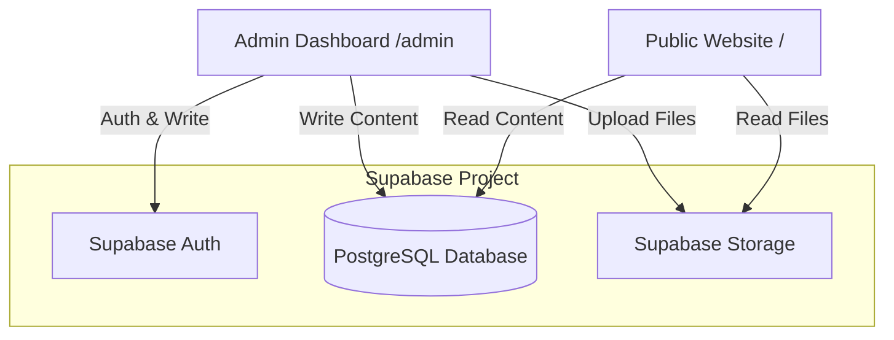

# Database Plan - Supabase Integration

This document outlines the planning for integrating **Supabase** as the backend service for the Aruna Karsa website. It covers database tables, authentication, image/file storage, and row-level security (RLS).

## 1. Objectives

- **Database**: Store dynamic site content, pages configurations, services, portfolio projects, and blog posts.
- **Authentication**: Secure the admin dashboard (`/admin`) using Supabase Auth (Email & Password).
- **Storage**: Manage image uploads (hero backgrounds, logos, portfolio photos, blog featured images) using Supabase Storage buckets.
- **Security**: Implement Row Level Security (RLS) policies to allow public read-only access to site content, while limiting write/update/delete operations to authenticated admin users.

---

## 2. Supabase Services Layout



---

## 3. Database Schema Design

We will use the following tables to manage site content:

### A. Site Configuration (`site_config`)
A single-row table containing global website configuration.
- `id` (int, primary key)
- `site_name` (text)
- `logo_url` (text)
- `contact_email` (text)
- `contact_phone` (text)
- `contact_address` (text)
- `social_links` (jsonb: `{ "instagram": "", "facebook": "", "whatsapp": "" }`)
- `footer_text` (text)
- `updated_at` (timestamp)

### B. Page Section Configurations (`pages`)
Stores configuration for each website page, specifying active sections, ordering, and customized text/images.
- `id` (uuid, primary key)
- `page_name` (text, unique - e.g., 'home', 'about', 'services', 'portfolio', 'contact', 'blog')
- `title` (text)
- `description` (text)
- `sections` (jsonb - list of sections with status and page-specific texts. Example:
  ```json
  [
    { "id": "hero", "enabled": true, "title": "Custom Hero", "subtitle": "..." },
    { "id": "about", "enabled": true },
    { "id": "services", "enabled": true }
  ]
  ```)
- `updated_at` (timestamp)

### C. Services (`services`)
List of services provided by Aruna Karsa.
- `id` (uuid, primary key)
- `title` (text)
- `description` (text)
- `icon_name` (text - references Lucide icon key, e.g., 'PenTool')
- `features` (text[] - array of bullet points)
- `display_order` (int)
- `created_at` (timestamp)

### D. Portfolio (`portfolio`)
List of projects completed or under construction.
- `id` (uuid, primary key)
- `title` (text)
- `category` (text - 'residential', 'commercial', 'interior')
- `category_label` (text - 'Residensial', 'Komersial', 'Interior')
- `location` (text)
- `year` (text)
- `area` (text)
- `status` (text - 'Selesai', 'Pembangunan', 'Perencanaan')
- `image_url` (text)
- `description` (text)
- `client` (text)
- `materials` (text[] - array of materials used)
- `created_at` (timestamp)

### E. Blog Posts (`blog_posts`)
Articles and blogs published on the site.
- `id` (uuid, primary key)
- `title` (text)
- `slug` (text, unique)
- `excerpt` (text)
- `content` (text - HTML/Markdown content)
- `category` (text)
- `author` (text)
- `date` (text - human-readable or timestamp)
- `read_time` (text)
- `image_url` (text)
- `is_published` (boolean)
- `created_at` (timestamp)

---

## 4. Authentication Strategy

We will use **Supabase Auth** with local session cookies for the Next.js App Router:
- Create a Next.js middleware / proxy or layout checks utilizing `@supabase/ssr` to verify user auth status.
- Admin login is handled at `/admin/login`. Once authenticated, session cookies are managed via `@supabase/ssr` to ensure Server Components can fetch session data.
- Read operations from the public client will bypass authentication (an anonymous/public key is used via the Supabase client).

---

## 5. Storage (Media) Plan

- A public bucket named `aruna-assets` will be created in Supabase Storage.
- Bucket permissions:
  - Public can Read all files.
  - Authenticated admin users can Upload, Edit, and Delete files.
- Folders inside the bucket:
  - `/logos/` (site logos)
  - `/heroes/` (page background headers)
  - `/portfolio/` (project images)
  - `/blog/` (blog feature images)

---

## 6. Implementation Steps

1. **Supabase CLI / Dashboard Setup**: Create the Supabase project, run the SQL migrations to setup tables.
2. **Dependency Installation**: Install `@supabase/supabase-js` and `@supabase/ssr` in `package.json`.
3. **Database Client Setup**: Create server and client supabase utility functions in `lib/supabase/`.
4. **Row Level Security (RLS)**: Configure policies on PostgreSQL tables and storage buckets.
5. **Seeding**: Write a seeding script to populate PostgreSQL tables with existing static data.
6. **Frontend Integration**: Transition components to fetch from the Supabase Client (Server & Client side).
